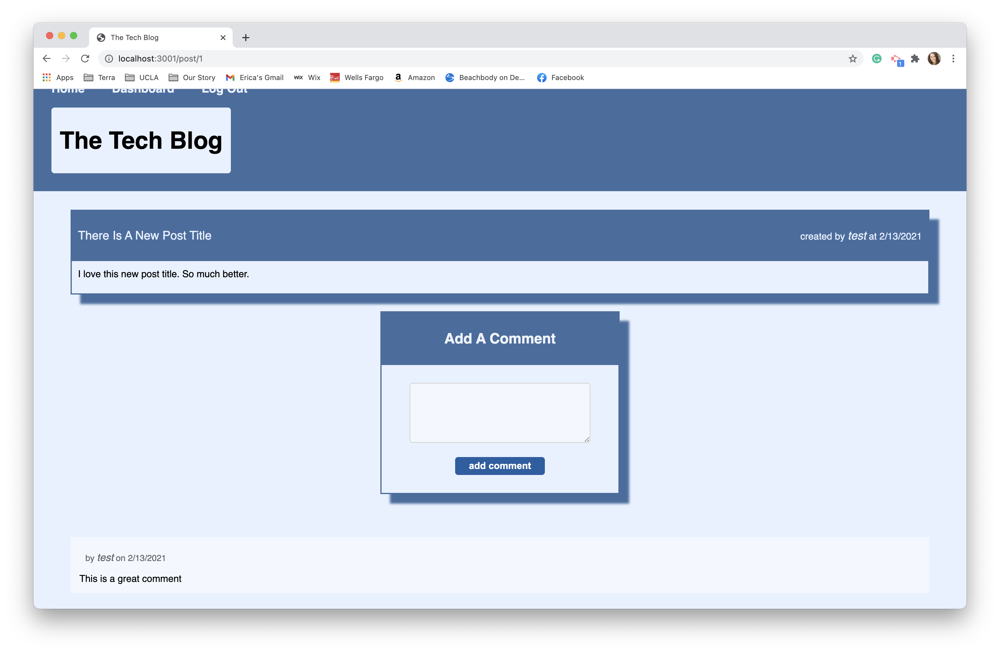

# The Tech Blog 
  

 
## Description
The Tech Blog is a MySQL CMS-Style blog site, It was developed using the MVC (Model View Controller) paradigm in it's architectural structure, Handlebars.js, Sequelize, and Express-Sessions.

The Tech Blog gives users a place where they can discuss with other users technical concepts, recent advancements, new technologies, etc. Users can create their own accounts, create edit and delete posts, and comment on other user's posts.

## Table of Contents
  
* [Description](#description)
* [Features](#features)
* [Languages](#languages)
* [Links](#link)
* [Usage](#usage)
* [Installation](#installation)
* [Screenshots](#screenshots)
* [License](#license)

## Features
    
- MySQL Database
      
- Express-Sessions
      
- Node.js
      
- Handlebars
      
- bcrypt
      
- dotenv
      
- Sequelize

## Languages

JavaScript, HTML, CSS, Node, Sequelize, MySQL, Express, Express-Sessions, Handlebars

## Link 

[The Tech Blog Deployed Page](https://es-tech-blog.herokuapp.com/)

[The Tech Blog GitHub](https://github.com/ericasiegel/cms-blog.git)

## Usage

The Tech Blog is a place where people in the Tech industry can come together and discuss new avancements in technologies, concepts, issues/solutions, etc. The can create their own posts, edit them, and comment on other posts.

### App Instructions
    
- Create an account using your email, username, and a unique password
      
- Upon Sign Up you will be redirected to the main page of the site.
      
- When you click on a blog post you can view the post and it's comments and add a comment yourself.
      
- When you visit the dashboard you can click the 'New Post' button to create a new blog post.
      
- When the post is created you are redirected to your Dashboard where you can view your new post. 
      
- You can click on the 'Edit Post' button, which leads you to a page where you can edit the 'Title' and 'Content' of that post or Delete it. You can also add a comment about the new edit.
      
- If you are inactive for 10 minutes the session will end and you will be logged out of your account.

## Screenshots
    
### Main Page

      
### Sign Up Page

      
### Log In Page

      
### Dashboard

      
### Creat New Post

      
### Edit Post

      
### Single Blog Page

## Credits

- [Node.js](https://nodejs.org/en/)
- [Express-Handlebars](https://www.npmjs.com/package/express-handlebars)
- [MySQL2](https://www.npmjs.com/package/mysql2)
- [Sequelize](https://www.npmjs.com/package/sequelize)
- [Dotenv Package](https://www.npmjs.com/package/dotenv)
- [Bcrypt Package](https://www.npmjs.com/package/bcrypt)
- [Express-Session](https://www.npmjs.com/package/express-session)
- [Connect-Session-Sequelize](https://www.npmjs.com/package/connect-session-sequelize)
    

## License

This project is covered under MIT License

